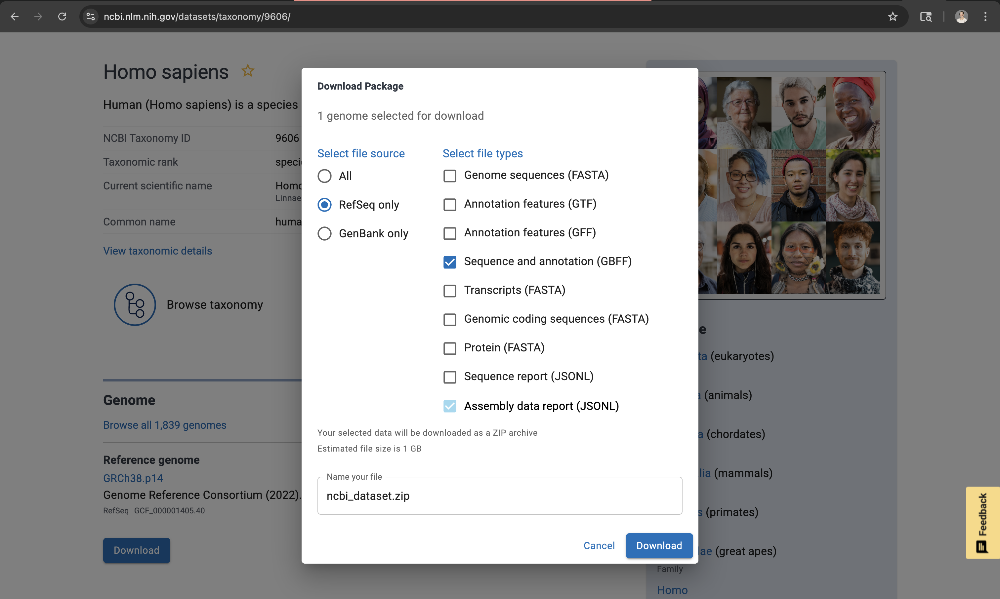

# mRNA Stability Project

## Step 0: Working with the large files in this repository requires GitLFS

### Git LFS Instructions for Collaborators and Reproducibility

This repository uses **Git Large File Storage (LFS)** for large files, such as `preprocessed_data/utrs.tsv`. To ensure you get the full content of these files, follow the steps below.

#### 1. Install Git LFS

**Mac (Homebrew):**

```bash
brew install git-lfs
git lfs install
```

**Linux (Debian/Ubuntu):**

```bash
sudo apt-get install git-lfs
git lfs install
```

**Windows:**
Download and run the installer from [https://git-lfs.github.com](https://git-lfs.github.com).

---

#### 2. Clone the Repository

```bash
git clone https://github.com/tessabass01/mRNA-stability.git
cd mRNA-stability
```

Git LFS automatically sets up the hooks for large files during the clone.

---

#### 3. Pull LFS-Tracked Files

After cloning, fetch the real content for all LFS-tracked files:

```bash
git lfs pull
```

This replaces the pointer files with the actual large files in your working directory.

---

#### 4. Pull Updates in the Future

When pulling changes from GitHub that include updates to LFS-tracked files:

```bash
git pull
git lfs pull
```

> This ensures you always get the latest version of large files.

---

#### *Notes for Collaborators*

* If a file looks like a pointer (small text file with `oid sha256`), you haven’t pulled the real content yet — run `git lfs pull`.
* Only files tracked via LFS are affected; small files (scripts, metadata TSVs, etc.) work normally with Git.
* If you cloned the repository before the recent cleanup, you may need to **re-clone** to avoid issues with rewritten history.


## Step 1: Gather, clean, and combine the data

We used two types of data for this project:
 - mRNA half-lives from human transcripts
    - [This paper](https://genomebiology.biomedcentral.com/articles/10.1186/s13059-022-02811-x#availability-of-data-and-materials) that came out in 2022 has the human mRNA half-life dataset that we used. Here is a link to the raw dataset from that paper: https://github.com/vagarwal87/saluki_paper/blob/main/Fig1_S1_S2/all_HLs_human.txt.gz   
    - We also added this dataset to our repository. It can be found at `raw_data/all_HLs_human.txt`
 - Sequence and annotation file for knowing where the UTRs are in the sequence (GBFF from NCBI)
    - You can download the file from this link: https://www.ncbi.nlm.nih.gov/datasets/taxonomy/9606/ 
    - When you get to the link, press the blue `Download` button
    - Select `RefSeq only` and the `GBFF` file (Sequence and annotation)
    
    - Then, click the blue `Download` button again. After a few seconds, you will have a zip file called ncbi_dataset.zip
    - Move the file into your desired directory and then double click on it to unzip it into a folder called `ncbi_dataset`
    - Within the folder, the path to the data file we used is `ncbi_dataset/ncbi_dataset/data/GCF_000001405.40/genomic.gbff`
    - This file serves as the input for the `extract_utrs.py` script in the `scripts/` directory of this repository
    - **Note:** We could not include this file in our repository because this is a very large file (4.84 GB). You can download it and run the script to check for reproducibility from raw to processed data. However, if you want to eliminate downloading such a large file onto your computer, you can skip downloading this file and just use the preprocessed dataset found at `preprocessed_data/utrs.tsv` in this repository.
    - **Note:** If you run `extract_utrs.py` on the GBFF file to process the raw data, make sure to replace the `file_path` variable in `extract_utrs.py` to match the path to the GBFF file on your computer!!!


## Step 2: Embed UTRs using DNABERT-2

In order to plot or predict anything using sequence data, we have to convert the sequence into something the computer will understand: numbers. DNABERT-2 is a foundational transformer that is trained to extract meaningful motifs and characteristics out of a DNA sequence and embed them in a way for the computer to retain the significance of the sequence when transforming it into numbers. It has been trained to learn motifs significant in other areas of interest like epigenetics and transcription factor binding.

Here is a link to the PDF if you want to give it a read: https://arxiv.org/pdf/2306.15006

## Step 3: Plot UTR embeddings on a UMAP to see if they cluster by length of half-life

Plotting the embeddings on a UMAP can help us visualize in a lower-dimensional space if there are meaningful clusters or any predictive power to our data. Based on what the UMAP looks like, we will be able to make more informed decisions about which ML models to use.

## Step 4: Train different regression models on UTR embeddings

Based on the project, I think a regression model would be more fitting, but if there isn't as much predictive power as we want to see, we could also trying binning the half-lives and using a classifier. We can make an informed decision on which ML model to use once we have the UMAP results. Sci-kit learn has a lot of regressors that are easy to implement, so we will use sci-kit learn.

## Step 5: Evaluate half-life predictions of unseen transcripts

If we use a regressor, we can use L2 as our loss function. Possible plots showing model performance include:
- predicted vs actual plot
- histogram or Q-Q plot of residuals
- feature importance plot
- learning curve

Metrics to include:
- MSE
- Adjusted R squared
